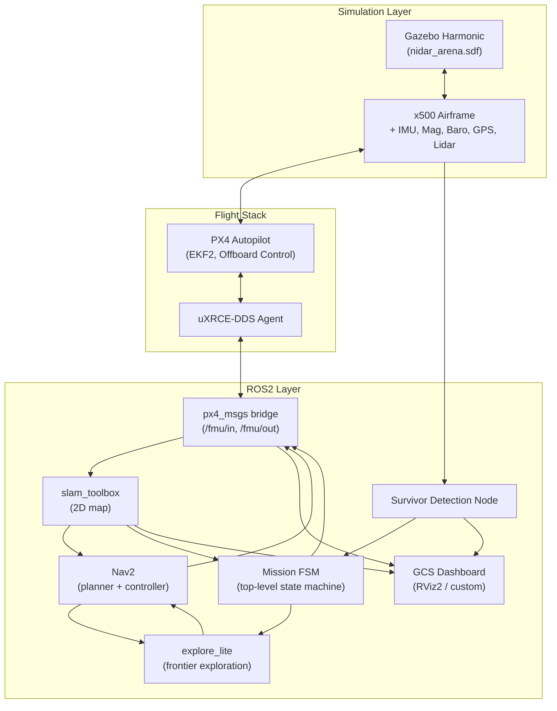
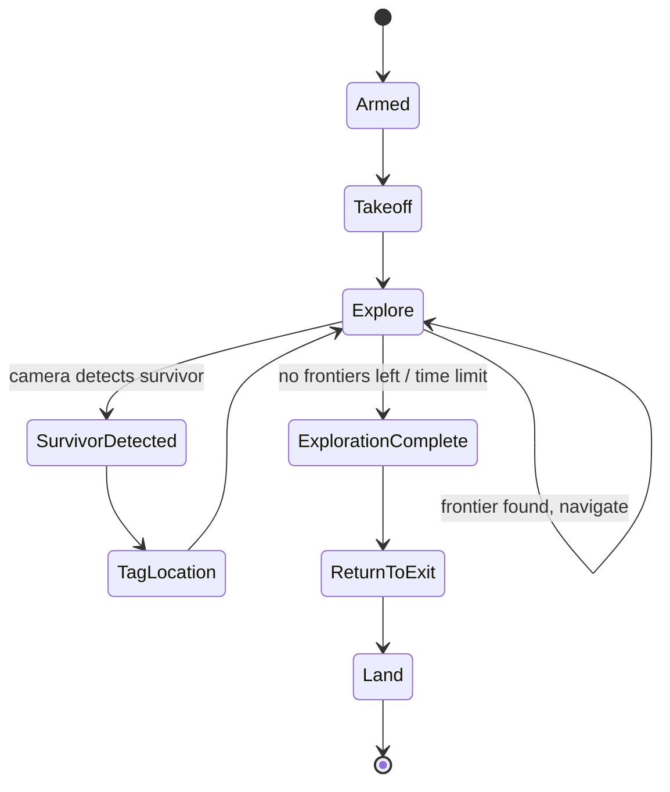

# NIDAR AirMouse — Complete Project Plan

**Autonomous GPS-Denied Indoor Search, Mapping & Survivor Localisation Drone**

This document is the single source of truth for how this project gets finished — architecture, file structure, phase-by-phase build order, and what "done" looks like at each stage. Update it as you go; it should always reflect current reality, not just the original plan.

---

## 1. System Architecture



---

## 2. Mission Flow (what the drone actually does, start to finish)



This state machine is Phase 6 below — it's the piece that turns everything else into an actual autonomous mission rather than a pile of working components.

---

## 3. Repository / File Structure

Target structure once every phase is complete. Bold = doesn't exist yet.

```
nidar_airmouse_ws/
├── README.md
├── .gitignore
├── src/
│   ├── airmouse_worlds/
│   │   └── worlds/
│   │       └── nidar_arena.sdf                  ✅ done
│   ├── airmouse_description/                     (x500 + lidar model overrides)
│   │   └── models/
│   │       └── **x500_lidar/model.sdf**          ⬜ Phase 1
│   ├── airmouse_mapping/
│   │   ├── config/
│   │   │   └── slam_params.yaml                 ✅ done (needs re-pointing at PX4 stack)
│   │   └── launch/
│   │       └── slam.launch.py                   ✅ done
│   ├── airmouse_bringup/
│   │   ├── config/
│   │   │   └── nav2_params.yaml                 ✅ done (needs re-pointing at PX4 stack)
│   │   └── **launch/full_stack.launch.py**       ⬜ Phase 4 (one command to bring up everything)
│   ├── **airmouse_ekf_config/**                  ⬜ Phase 3
│   │   └── **gps_denied_params.yaml**
│   ├── **airmouse_offboard_bridge/**             ⬜ Phase 4
│   │   └── **src/nav2_to_px4_bridge.py**         (translates Nav2 cmd_vel → PX4 TrajectorySetpoint)
│   ├── airmouse_perception/
│   │   ├── **src/survivor_detector.py**          ⬜ Phase 5
│   │   ├── **src/grid_tagger.py**                ⬜ Phase 5
│   │   └── **msg/SurvivorDetection.msg**         ⬜ Phase 5
│   ├── airmouse_control/
│   │   └── **src/mission_fsm.py**                ⬜ Phase 6
│   ├── m-explore-ros2/                            ✅ done (vendored)
│   └── **airmouse_gcs/**                         ⬜ Phase 7
│       └── **launch/dashboard.launch.py**
└── docs/
    ├── NIDAR_AirMouse_Project_Plan.md            (this file)
    └── **flight_test_logs/**                     ⬜ ongoing — save .ulg files here after real tests
```

**Rule going forward**: every new phase gets its own package (or clearly separated files within an existing one) — never bolt new logic into an existing file that's already working. This matches how the file-by-file, single-responsibility approach has worked so far.

---

## 4. Phase-by-Phase Plan

### Phase 0 — Foundation ✅ DONE
- PX4 + Gazebo Harmonic, x500 airframe, custom arena, all sensors verified, ROS2 bridge confirmed, manual flight proven via QGroundControl.
- **Commit checkpoint**: already pushed to GitHub.

---

### Phase 1 — Lidar Sensor
**Goal**: give the drone a sensor SLAM can actually consume.

| Step | File(s) touched |
|---|---|
| Add `<sensor type="gpu_lidar">` block to x500's SDF | `airmouse_description/models/x500_lidar/model.sdf` |
| Bridge lidar topic into ROS2 | `ros_gz_bridge` config, likely in `airmouse_bringup` |
| Verify raw scan data matches arena walls | manual check, no new file |

**Done when**: `ros2 topic echo /scan` (or equivalent) shows real range values that change sensibly as you fly manually through the corridor.

---

### Phase 2 — SLAM
**Goal**: a live, continuously-updating 2D map — the first mission-brief checkbox.

| Step | File(s) touched |
|---|---|
| Re-point `slam_toolbox` config at PX4's odometry + new lidar topic | `airmouse_mapping/config/slam_params.yaml` |
| Launch and fly manually, watch map build | no new file |
| Save a sample map + screenshot for documentation | `docs/` |

**Done when**: flying manually through the whole arena produces a map that visibly matches your corridor + rooms layout.

**Milestone**: worth a commit + possibly another progress post — this is the first fully demoable capability.

---

### Phase 3 — GPS-Denied Operation
**Goal**: stop relying on GPS, matching the real mission constraint.

| Step | File(s) touched |
|---|---|
| Reconfigure PX4 EKF2 params to distrust GPS, trust external vision | new `airmouse_ekf_config/gps_denied_params.yaml` |
| Feed SLAM pose into PX4 as external vision odometry | small bridge node, likely `airmouse_ekf_config/src/` |
| Verify drone holds position/navigates using only SLAM localization | flight test, log to `docs/flight_test_logs/` |

**Done when**: you can disable the simulated GPS entirely and the drone still holds position and takes commands correctly.

---

### Phase 4 — Autonomous Navigation
**Goal**: Nav2 + frontier exploration actually driving the drone, no human input.

| Step | File(s) touched |
|---|---|
| Re-tune Nav2 params for PX4 stack's actual frame names/topics | `airmouse_bringup/config/nav2_params.yaml` |
| Write the Nav2 → PX4 offboard translator (this is the piece that didn't exist on the old stack — Nav2 outputs `cmd_vel`, PX4 offboard wants `TrajectorySetpoint` + `OffboardControlMode`) | new `airmouse_offboard_bridge/src/nav2_to_px4_bridge.py` |
| Bring up `explore_lite` against the new stack | reuse existing `m-explore-ros2`, new launch entry |
| One-command full-stack launch file | new `airmouse_bringup/launch/full_stack.launch.py` |

**Done when**: launching one command results in the drone autonomously exploring the arena with zero manual `cmd_vel`/joystick input.

---

### Phase 5 — Survivor Detection *(can run in parallel with Phase 3/4 if you have a teammate free)*
**Goal**: the actual novel scoring differentiator.

| Step | File(s) touched |
|---|---|
| Camera-based detection node (start simple — color/shape threshold; upgrade to a trained model later if time allows) | new `airmouse_perception/src/survivor_detector.py` |
| Custom message type for a detection event | new `airmouse_perception/msg/SurvivorDetection.msg` |
| Fuse detection + current drone pose → grid cell | new `airmouse_perception/src/grid_tagger.py` |
| Place test "survivor" markers in the arena SDF for validation | edit `nidar_arena.sdf` |

**Done when**: flying past a placed marker in the arena produces a correctly-tagged grid coordinate, visible on the map.

---

### Phase 6 — Mission FSM
**Goal**: tie every phase together into one autonomous mission, matching the state diagram in Section 2.

| Step | File(s) touched |
|---|---|
| Top-level state machine node | new `airmouse_control/src/mission_fsm.py` |
| Wire in: takeoff trigger, explore-complete detection, survivor-tag hooks, return-to-exit, land | same file, single responsibility (just orchestration — no sensor/planning logic lives here) |

**Done when**: a single launch command results in full mission execution — arm through land — with zero human intervention at any point.

---

### Phase 7 — GCS Dashboard
**Goal**: the live display the brief requires (map, camera feed, survivor markers, drone position).

| Step | File(s) touched |
|---|---|
| RViz2 config showing map + camera + markers together, OR a lightweight custom web dashboard if RViz's earlier segfault issues resurface | new `airmouse_gcs/launch/dashboard.launch.py` |

**Done when**: a judge/observer watching only this screen can follow the mission end-to-end.

---

## 5. Suggested Order & Parallelization

```mermaid
gantt
    dateFormat X
    axisFormat %s
    section Solo track
    Phase 1 Lidar         :p1, 0, 1
    Phase 2 SLAM          :p2, after p1, 1
    Phase 3 GPS-denied    :p3, after p2, 1
    Phase 4 Nav2/Explore  :p4, after p3, 1
    Phase 6 Mission FSM   :p6, after p4, 1
    Phase 7 GCS           :p7, after p6, 1
    section Parallel track (teammate)
    Phase 5 Survivor Detection : p5, after p2, 3
```



Phase 5 only needs Phase 2's map to exist for grid-tagging context — it doesn't depend on Phase 3/4, so it's the best candidate to hand off in parallel if you have help.

---

## 6. Ongoing Discipline

- **One commit per completed sub-step**, not one giant commit per phase — makes it possible to find exactly where something broke.
- **Every new capability gets a flight-test log** saved to `docs/flight_test_logs/` (the `.ulg` files PX4 already generates) — this becomes evidence for the judges that the system was actually tested, not just theoretically built.
- **Update this document's checkboxes** (✅ / ⬜) as phases complete — it should never go stale.
