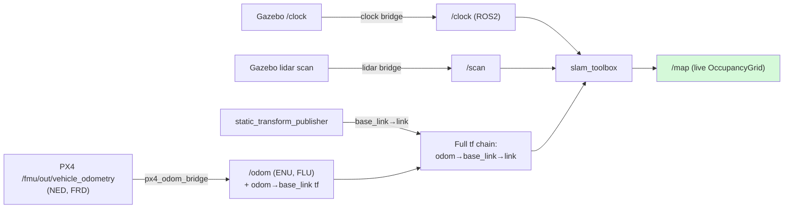
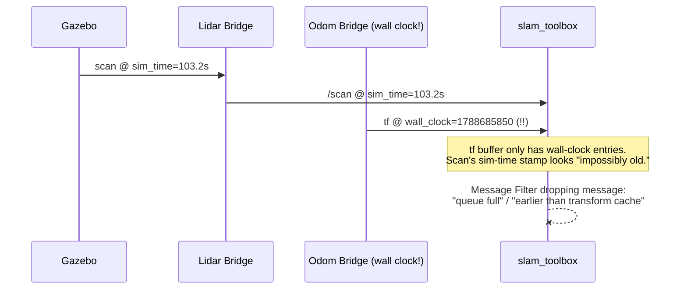

# NIDAR AirMouse — Session Recap: Phase 2 SLAM Working on PX4/Harmonic Stack

**Date:** 2026-09-06
**Phase:** Phase 2 (SLAM) — complete
**Depends on:** Phase 1 (lidar sensor + bridge)

---

## What this session accomplished

Got a live, real 2D map building on the new PX4 + Gazebo Harmonic stack — porting SLAM over from the abandoned sjtu_drone setup, writing a custom PX4-odometry-to-ROS2 bridge with verified NED→ENU conversion, and tracking down a genuinely subtle root cause (inconsistent simulated-vs-wall clock usage across nodes) that took a long, methodical elimination process to find.

---

## Visual: The Working Pipeline



---

## The Bug Hunt: Sim Time Inconsistency



**Root cause**: our custom `px4_odom_bridge` node was stamping its published `/odom` and `tf` messages using `self.get_clock().now()` — the system's real wall-clock time — while Gazebo, the lidar bridge, and slam_toolbox all operate on **simulated time** (seconds since sim start, driven by Gazebo's `/clock` topic). These two clocks never overlap, so `slam_toolbox`'s tf buffer could never find a matching transform for any scan message — it looked like every scan was either from the impossibly distant past or the future.

**Fix**: bridge `/clock` from Gazebo into ROS2, and explicitly set `use_sim_time: true` on **every** node in the chain — the odom bridge, the static lidar-mount transform, and `slam_toolbox` itself (added permanently to `slam_params.yaml` rather than left as an easy-to-forget CLI flag).

---

## Other bugs hit this session

| Symptom | Root Cause | Fix |
|---|---|---|
| `ros2 launch airmouse_mapping ...` failed with "package not found" | Workspace's own `install/setup.bash` was never sourced in that terminal | Explicit `source ~/nidar_airmouse_ws/install/setup.bash` every session |
| SLAM dropping every scan: "timestamp earlier than transform cache" | Sim-time vs wall-clock mismatch (see above) | Bridged `/clock`, added `use_sim_time` everywhere |
| SLAM dropping scans: "queue full" (after partial sim_time fix) | Static tf publisher was started *before* the sim_time fix, still on wall clock | Killed and restarted with `use_sim_time:=true` |
| Lidar frame `'link'` had no path to `base_link` | No transform existed between the lidar's own sensor frame and the drone body | Added static transform matching the exact mount offset from `x500_lidar_2d`'s own model.sdf |
| `start_px4_sim.sh` killed itself instantly on every run | `pkill -9 -f px4` matched the substring "px4" in the script's **own filename**, not just the target process | Changed pattern to `-f "bin/px4"` — specific enough to match only the actual compiled binary |
| SLAM kept dropping messages even after every other fix | Repeated manual terminal restarts had left duplicate clock/lidar/tf bridge processes running simultaneously, publishing slightly out of phase with each other | Wrote `full_test.sh` — one script that kills everything, **verifies** a genuinely empty process list before proceeding, then brings the whole stack up in order with no manual terminal juggling |

---

## Files added this session

- `airmouse_px4_bridge/` (new package) — `px4_odom_bridge.py`: converts PX4's NED/FRD odometry to ROS2-standard ENU/FLU, publishes `/odom` + `odom→base_link` tf
- `airmouse_mapping/config/slam_params.yaml` — updated frame/topic names for the new stack, added `use_sim_time: true`
- `airmouse_mapping/launch/slam_stack.launch.py` (new) — one-command bringup of the entire ROS2-side pipeline (clock bridge, lidar bridge, odom bridge, static tf, SLAM)
- `scripts/start_px4_sim.sh` (new) — starts the agent + PX4 SITL, the one piece that lives outside ROS2's launch system
- `scripts/full_test.sh` (new) — the final, reliable entry point: tears down everything, **verifies** a clean process slate, then brings up the entire stack (sim → SLAM → map) in one command with a clear SUCCESS/FAILED result. This is now the actual way to start Phase 2, not the individual pieces above.

## Confirmed working, end to end

```
~/nidar_airmouse_ws/scripts/full_test.sh
```
runs the complete teardown → clean-slate check → sim startup → SLAM launch → `/map` verification sequence unattended, and reliably ends in a real `OccupancyGrid` with live data. This is the reproducible foundation everything from Phase 3 onward builds on.

---

## What this unblocks

Phase 3 (GPS-denied operation) — PX4's EKF2 needs exactly this kind of external pose estimate (now available via `/odom`) to replace GPS as its position source. The odometry bridge built this session is a direct prerequisite for that.
