# NIDAR AirMouse — Session Recap: Phase 3 GPS-Denied Operation, Genuinely Complete

**Date:** 2026-09-06
**Phase:** Phase 3 (GPS-Denied Operation) — complete
**Depends on:** Phase 2 (SLAM)

---

## What this session accomplished

Took PX4's GPS completely offline and got the drone's full position, height, and heading estimate running entirely on vision odometry derived from your own SLAM map — with real, verified numbers proving it, not just "no errors shown." Along the way, chased down what looked like a fundamental architecture problem (yaw won't converge) that turned out to be a much simpler bug (a duplicate process) — a good reminder that "looks like a hard theoretical problem" is worth one more diagnostic pass before accepting it as a limitation.

---

## Visual: The Debugging Arc

```mermaid
flowchart TD
    A["Set EKF2_HGT_REF=0<br/>Baro as height ref"] --> B["Set EKF2_EV_CTRL=11<br/>Enable vision pos+yaw"]
    B --> C["Verify: cs_ev_pos/yaw/hgt = True<br/>alongside GPS still on"]
    C --> D["Set EKF2_GPS_CTRL=0<br/>GPS fully off"]
    D --> E["commander check: FAILED<br/>heading estimate invalid"]
    E --> F["Hypothesis: SLAM zero-yaw<br/>vs mag-locked heading"]
    F --> G["Loosened variance - no change"]
    G --> H["Added missing use_sim_time<br/>to vision_odom_bridge"]
    H --> I["pos_test_ratio fixed!<br/>hdg_test_ratio still failing"]
    I --> J["Time-boxed as 'known limitation'"]
    J --> K["Decided to push further"]
    K --> L["Restarted ekf2 module alone"]
    L --> M["hdg_test_ratio: near zero!<br/>...but cs_ev_pos/yaw/hgt: False"]
    M --> N["Checked uxrce_dds_client status:<br/>Payload rx: 0 B/s"]
    N --> O["Found: Publisher count = 2<br/>duplicate vision_odom_bridge"]
    O --> P["Killed duplicate, one instance only"]
    P --> Q["Payload rx: 3581 B/s - real data!"]
    Q --> R["cs_ev_pos/yaw/hgt: True<br/>hdg_test_ratio: 0.00001<br/>pos_test_ratio: 0.00003"]

    style R fill:#d5f9d9
    style E fill:#f9d5d5
    style M fill:#f9e0d5
```



---

## The real lesson: two different bugs wearing the same disguise

Both failures in this session presented identically — PX4's estimator either rejecting or simply not seeing vision data — but had **completely different causes**:

1. **First failure** (position fusion rejected): `vision_odom_bridge` was never launched with `use_sim_time:=true`, so it stamped messages with wall-clock time while PX4 runs on simulated time. Fixed by adding the flag.

2. **Second failure** (heading wouldn't converge, later revealed to actually be "vision not received at all"): a duplicate `vision_odom_bridge` process — left running from an earlier restart because `full_test.sh`'s cleanup list never included that process name — meant **two competing DDS publishers** with conflicting identities, which silently corrupted the data path rather than erroring visibly. `uxrce_dds_client status`'s `Payload rx: 0 B/s` was the number that finally exposed it.

**Neither bug was actually about EKF2 tuning or SLAM's yaw reference** — both were process-hygiene issues (a missing flag, a leftover duplicate process) that happened to manifest as EKF2-shaped symptoms. Worth remembering: when a simulation stack has been restarted many times across a long session, "is there a stray duplicate process" is worth checking before reaching for a deeper architectural explanation.

---

## Bugs hit this session

| Symptom | Root Cause | Fix |
|---|---|---|
| `EKF2_HGT_REF` was already set to GPS (1) | Default PX4 SITL config | Explicitly set to Baro (0) *before* touching GPS_CTRL, to avoid a moment with no valid height source at all |
| Position fusion rejected (`pos_test_ratio: 1.8`) | `vision_odom_bridge` missing `use_sim_time:=true` | Added the flag explicitly at launch |
| `heading estimate invalid`, ~106° disagreement | Initially misdiagnosed as SLAM-yaw-vs-mag-lock architecture problem | Actually irrelevant — see next row |
| `cs_ev_pos/yaw/hgt` all `False` after EKF2 module restart | `uxrce_dds_client`'s incoming subscription broke when only `ekf2` was restarted, not the whole DDS client (`Payload rx: 0 B/s`) | Full clean restart of the whole stack, not just one module |
| Still `Payload rx: 0 B/s` even after a full clean restart | **Duplicate `vision_odom_bridge` process** — `full_test.sh` never killed it in prior runs, so instances accumulated | Killed all instances, ran exactly one; added `vision_odom_bridge` to `full_test.sh`'s kill list permanently |

---

## Final verified state

```
cs_gnss_pos: False    cs_ev_pos: True
cs_gps_hgt: False     cs_ev_hgt: True
cs_gnss_vel: False    cs_ev_yaw: True
cs_inertial_dead_reckoning: False

hdg_test_ratio: 0.00001   (pass threshold: 1.0)
pos_test_ratio: 0.00003   (pass threshold: 1.0)
pre_flt_fail_innov_heading: False
pre_flt_fail_innov_pos_horiz: False
```

GPS is genuinely, completely out of PX4's estimator. Position, height, and heading are all fused from SLAM-derived vision odometry alone.

---

## Files changed this session

- `airmouse_px4_bridge/vision_odom_bridge.py` (new node, built earlier this session) — reads `map→base_link` tf, converts ENU/FLU to NED/FRD (reusing Phase 2's self-inverse quaternion math), publishes `/fmu/in/vehicle_visual_odometry`
- `scripts/full_test.sh` — added `vision_odom_bridge` to the process-cleanup list, closing the gap that let duplicates accumulate
- `docs/NIDAR_AirMouse_Project_Plan.md` — Phase 3 marked complete, MVP cutline updated (nothing left to cut from this phase)

## EKF2 parameters set (not yet persisted across reboots - runtime only)

```
EKF2_HGT_REF  = 0   (Baro)
EKF2_EV_CTRL  = 11  (horizontal pos + vertical pos + yaw; velocity bit intentionally excluded)
EKF2_GPS_CTRL = 0   (GPS fully disabled)
```

**Note:** these are currently set via `px4-param set` at runtime each session, not persisted to a startup config. Worth adding to a PX4 airframe init script before final submission so they survive a real reboot rather than needing to be re-applied by hand.

---

## What this unblocks

Phase 4 (Nav2 + autonomous exploration) can now build on a genuinely GPS-free localization stack — Nav2 needs a stable, continuously-updating pose estimate to plan against, and that's exactly what this session delivered.
