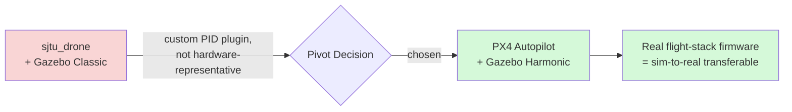
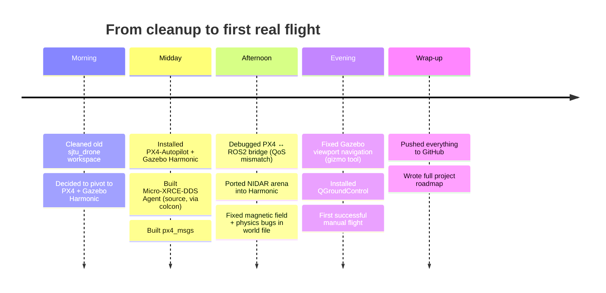
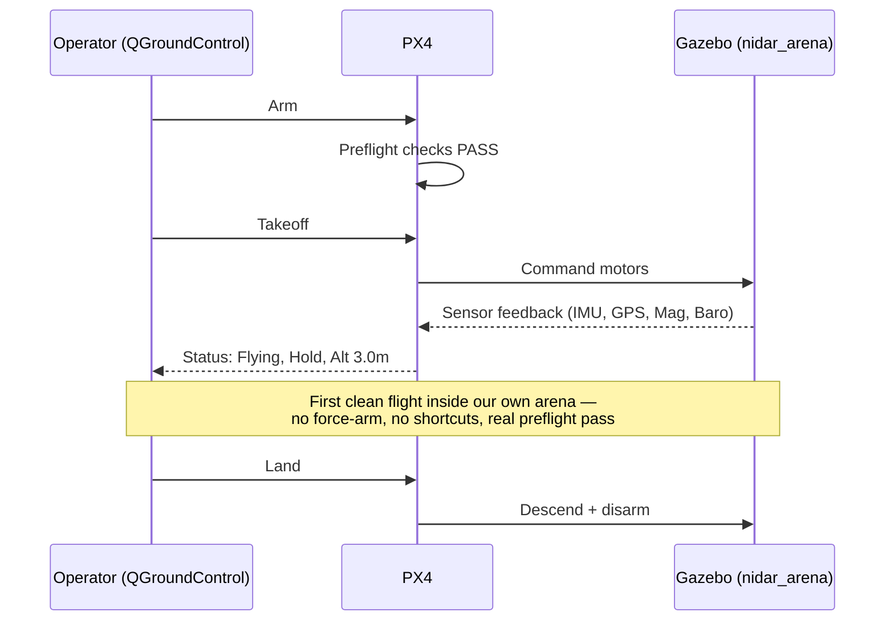

# NIDAR AirMouse — Today's Session Recap

**A visual summary of the stack pivot, debugging journey, and first successful flight**

---

## 1. The Big Decision — Why We Pivoted



Everything built on `sjtu_drone` was a working *simulation*, but not a working *hardware path* — the custom Gazebo Classic plugin would never run on real flight-controller hardware. PX4 does.

---

## 2. Today's Timeline



---

## 3. Bugs Fixed Today

| # | Symptom | Root Cause | Fix |
|---|---|---|---|
| 1 | Gazebo Classic wouldn't run alongside Fortress | Version confusion (`ign gazebo` vs `gz sim`) | Identified correct commands per Gazebo generation |
| 2 | `ros2 topic list` showed nothing for `/fmu/*` topics | **QoS mismatch** — PX4 publishes `BEST_EFFORT`, default ROS2 subscriber wants `RELIABLE` | Used `qos_profile_sensor_data` explicitly |
| 3 | Micro-XRCE-DDS-Agent build failed | Broken upstream git tag in `v2.4.2`'s CMake fetch | Built via `colcon` (uses rosdep-resolved deps) instead of raw CMake |
| 4 | Old snap-installed agent couldn't create PX4 entities | Snap package hadn't been updated since 2023 — didn't know newer message types | Rebuilt agent from source, matching PX4's actual version |
| 5 | World file wouldn't load in Harmonic | `PX4_GZ_WORLD` env var didn't match internal `<world name>` | Renamed to match |
| 6 | Magnetometer reading ~10,000x too weak | Tangled edit history across Fortress → Classic → Harmonic left world properties broken | **Rebuilt the world file from `default.sdf`'s known-good preamble**, keeping only the wall geometry |
| 7 | Couldn't navigate the Gazebo viewport | Transform/rotate tool was active instead of Select tool | Switched toolbar tool |
| 8 | QGroundControl download kept failing | Stale CloudFront URL + wrong OS-version release | Found correct v5.0.8 asset (compatible with Ubuntu 22.04) via GitHub releases |

Eight real, separate root causes — each one looked like it could've been any of the others at first. This is what "the debugging was slow because everything looked the same" actually looks like in hindsight.

---

## 4. What We Ended Up With

```mermaid
flowchart TB
    subgraph Verified["✅ Verified Working Today"]
        direction TB
        A1["Gazebo Harmonic + Custom NIDAR Arena"]
        A2["x500 Airframe (~10\" prop class)"]
        A3["IMU + Magnetometer + Barometer + GPS<br/>(all reading real-world-accurate values)"]
        A4["PX4 ↔ ROS2 Bridge (uXRCE-DDS)"]
        A5["QGroundControl — Real Arm/Takeoff/Hover"]
    end
    A1 --> A2 --> A3 --> A4 --> A5
```

---

## 5. The Milestone Moment



This is the flight shown in today's screenshot: **"Flying" → "Hold" → 3.0m altitude → 10 satellites → clean preflight.** Real ground-control link, real arm sequence — not a shell-command hack.

---

## 6. Where This Leaves Us

- **Foundation phase: complete.** Everything from here builds *on top of* a verified-working stack, not around unresolved uncertainty.
- **Actual mission-brief scoring work**: still ahead — lidar, SLAM, GPS-denied config, survivor detection, the mission FSM, and the GCS dashboard (see the full Project Plan document for the phase-by-phase breakdown).
- **Repo status**: pushed to `github.com/T-Rajeev30/nidar-airmouse`, ready for the next phase to build on.
