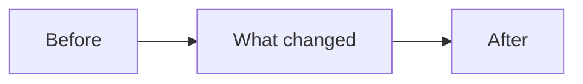
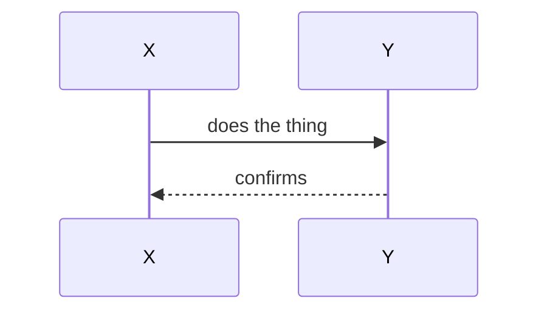
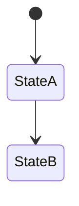

# NIDAR AirMouse — Session Recap: [SHORT TITLE]

**Date:** YYYY-MM-DD
**Commit(s):** [paste commit hash(es) once pushed]
**Phase:** [which phase from the Project Plan this belongs to]

---

## What this session accomplished

One or two sentences — the plain-English version of the commit message.

---

## Visual: [pick whichever fits the change]

<!-- Flowchart for a new component/pipeline -->

<!-- OR sequence diagram for a new interaction/flow -->

<!-- OR state diagram if this session added/changed a state machine -->

---

## Bugs hit this session (if any)

| Symptom | Root Cause | Fix |
|---|---|---|
| | | |

---

## Files touched

- `path/to/file` — what changed and why

---

## What this unblocks / what's next

One line pointing at the next item in the Project Plan.
